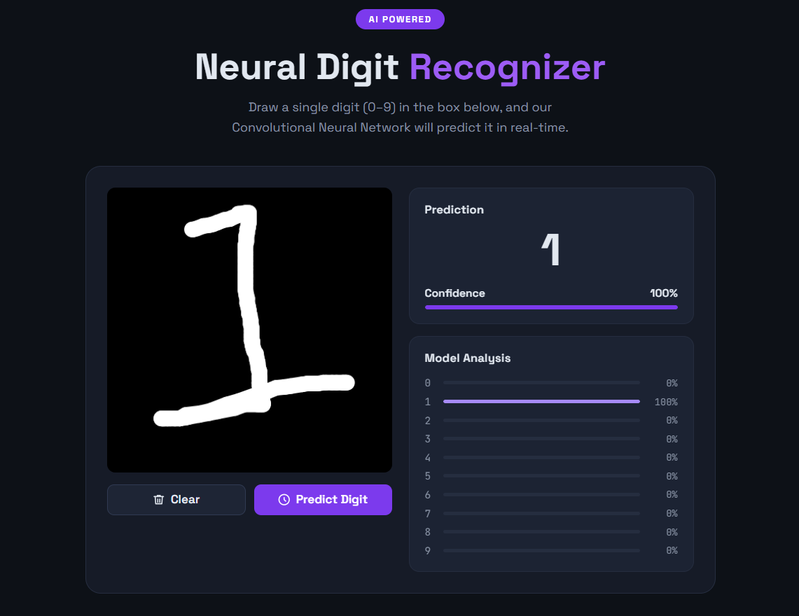

# Neural Digit Recognizer

A full-stack AI-powered web application that recognizes handwritten digits using a Convolutional Neural Network (CNN) trained on the MNIST dataset.

## Features

* Draw digits directly on an interactive canvas
* Real-time digit prediction using a trained CNN model
* Confidence score visualization
* FastAPI backend for inference
* React frontend with modern UI
* Achieved **99.54% test accuracy** on the MNIST dataset

---

## Tech Stack

### Frontend

* React.js
* CSS Modules
* JavaScript

### Backend

* FastAPI
* TensorFlow / Keras
* NumPy
* Pillow

### Machine Learning

* Convolutional Neural Network (CNN)
* MNIST Handwritten Digits Dataset

---

## Project Structure

```text
neural-digit-recognizer/
│
├── backend/
│   ├── main.py
│   ├── requirements.txt
│   └── model/
│
├── frontend/
│   ├── src/
│   ├── public/
│   └── package.json
│
├── train_model.py
├── README.md
└── .gitignore
```

---

## Model Architecture

The CNN consists of:

* Conv2D (32 filters)

* Batch Normalization

* Conv2D (32 filters)

* MaxPooling

* Dropout

* Conv2D (64 filters)

* Batch Normalization

* Conv2D (64 filters)

* MaxPooling

* Dropout

* Dense (256 units)

* Batch Normalization

* Dropout

* Output Layer (10 classes)

### Performance

| Metric        | Value  |
| ------------- | ------ |
| Test Accuracy | 99.54% |
| Test Loss     | 0.0129 |

---

## Installation

### Clone Repository

```bash
git clone https://github.com/Kulsum0580/digit_recognition_project.git
cd digit_recognition_project
```

---

## Backend Setup

Install dependencies:

```bash
pip install -r backend/requirements.txt
```

Train the model:

```bash
python train_model.py
```

Start FastAPI server:

```bash
cd backend
python -m uvicorn main:app --reload
```

Backend runs on:

```text
http://127.0.0.1:8000
```

API Documentation:

```text
http://127.0.0.1:8000/docs
```

---

## Frontend Setup

Navigate to frontend:

```bash
cd frontend
```

Install dependencies:

```bash
npm install
```

Start development server:

```bash
npm start
```

Frontend runs on:

```text
http://localhost:3000
```

---

## Usage

1. Open the web application.
2. Draw a digit (0–9) on the canvas.
3. Click **Predict Digit**.
4. View:

   * Predicted Digit
   * Confidence Score
   * Probability Distribution

---

## Future Improvements

* Real-time prediction while drawing
* Dark/Light mode toggle
* Mobile responsiveness improvements
* Deploy backend and frontend online
* Support for custom handwriting datasets

---

## Screenshots

### Main Interface

Add screenshots here after deployment.

## Screenshots



## Author

**Umme Kulsum**

GitHub: https://github.com/Kulsum0580

---

## License

This project is licensed under the MIT License.
